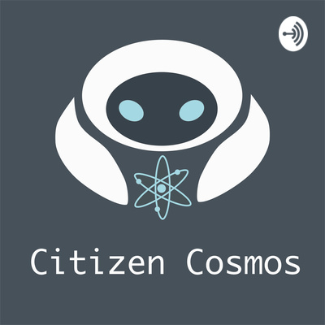

# Citizen Cosmos

Citizen Cosmos is a podcast about the masterminds behind the Cosmos Ecosystem, their tech ambitions and personalities. Feel free to like and share any episodes or just leave your comments, feedback and wishes!

**Listen via [Anchor](https://anchor.fm/citizencosmos)**

**Sign to [RSS feed](https://anchor.fm/s/1e2d6720/podcast/rss)** 

 

List of Episodes:

1: [Gavin from Figment Networks. Governance](https://anchor.fm/citizencosmos/episodes/Gavin-from-Figment-Networks--Governance-ed5jm8)

2: [Jack Zampolin, Game of Zones & IBC](https://anchor.fm/citizencosmos/episodes/Jack-Zampolin--Game-of-Zones--IBC-ed5jul)

3: [Kwun Yeung, Forbole & Desmos](https://anchor.fm/citizencosmos/episodes/Kwun-Yeung--Forbole--Desmos-edesno) 

4: [Sunny Aggarwal, Tendermint & Sikka](https://anchor.fm/citizencosmos/episodes/Sunny-Aggarwal--Tendermint--Sikka-edpmcj)

5: [Lee Hyung Yeon, Bharvest & Data Privacy](https://anchor.fm/citizencosmos/episodes/Lee-Hyung-Yeon--Bharvest--Data-Privacy-ee1vus)

6: [JK, Stake.Fish, Technology, Cosmos and staking](https://anchor.fm/citizencosmos/episodes/JK--Stake-Fish--tech-adoption-eee4cj)

7: [ Adriana Mihai, KalpaTech & Passion](https://anchor.fm/citizencosmos/episodes/Adriana-Mihai--KalpaTech--Passion-eemjns)

8: [Aragon chain, ChainSafe & DAO](https://anchor.fm/citizencosmos/episodes/Aragon-chain--ChainSafe--DAO-ef1ohv)

Timeline:

    1.10: Getting started with Cosmos

    2.43: Chainsafe introduction

    5.05: How did you choose Cosmos

    15.50: The technical aspects of how Aragon works with Cosmos and Ethereum

    19.36: Aragon Court

    29.36: Ethermint as the Cosmos module

    31.12: How to build two communities around the project

    34.10: Aragon on other networks

    37.54: PoS maturity

    39.40: Personal motivation

    43.30: Jorge’s history of becoming a co-founder of Aragon

    46.35: Problems which can be solved by a DAO

    51.10: Inspirational projects using Aragon DAOs

9. [Ethan Buchman, the now and then of Cosmos](https://anchor.fm/citizencosmos/episodes/Ethan-Buchman--the-now-and-then-of-Cosmos-eff5vm)

10. [ Gregory Landua, Regen Network & ecological regeneration](https://anchor.fm/citizencosmos/episodes/Gregory-Landua--Regen-Network--ecological-regeneration-efv5cq)
